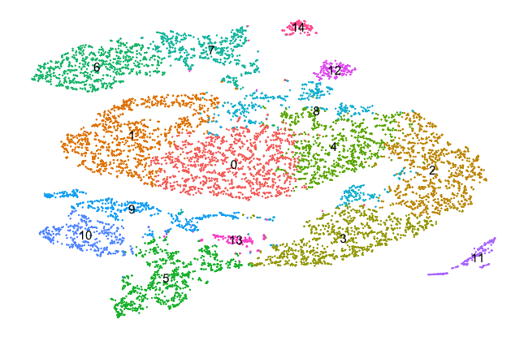
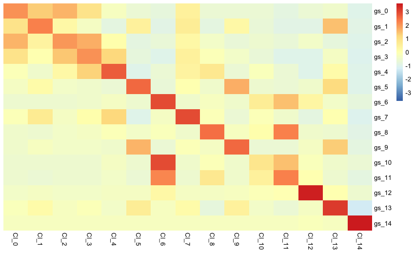
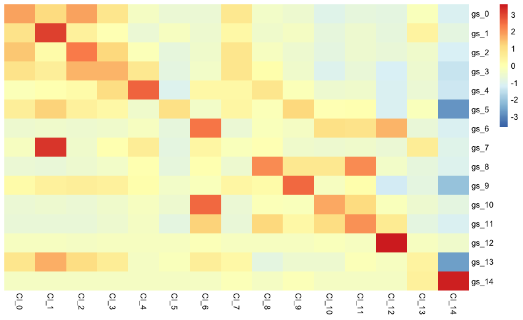

# Tutorial: Identification of equivalent cells across single-cell RNA-seq datasets

This tutorial is an example of using scID for mapping across two 10X datasets of E18 mouse brain [single-cells](https://support.10xgenomics.com/single-cell-gene-expression/datasets/2.1.0/neuron_9k) and [single-nuclei](https://support.10xgenomics.com/single-cell-gene-expression/datasets/2.1.0/nuclei_900) from cortex, hippocampus and subverticular zone. To speed-up preprocessing you can download the [TPM-normalized data](../ExampleData/) we have pre-computed.

The reference cells can be grouped into 15 clusters as shown in the next plot.


### Mapping across datasets
First, we need to load scID library and read the files. 
```
library(scID)

target_gem <- readRDS(file="~/scID/ExampleData/target_gem.rds")

reference_gem <- readRDS(file="~/scID/ExampleData/reference_gem.rds")
reference_clusters <- readRDS(file="~/scID/ExampleData/reference_clusters.rds")
```

Next, we run scID with the above inputs and the following settings:
1. ```normalize_reference``` is set to ```FALSE``` as the reference data is already normalized. Any library-depth normalization (e.g. TPM, CPM) is compatibe with scID, but not log-transformed data. 
2. ```logFC``` is defining minimum logFold-change for a gene to be seleced as cluster-specific. Low ```logFC``` lead to identification of longer lists of cluster-specific genes that can help resolve classes in presense of very similar reference clusters but will require longer computational time.  
3. ```estimate_weights_from_target``` is set to ```TRUE``` in order to estimated gene weights from the target by selecting training target cells as described in the [manuscript](https://www.biorxiv.org/content/10.1101/470203v1). Alternatively, weights can be estimated from the reference data (using the known cell labels), which is recommended when library depth of the two datasets is similar or when the reference clusters are transcriptionally similar. 
4. ```only.pos``` is set to ```FALSE``` to include cluster-specific downregulated genes that can help distinguish clusters from their nearest neighbours. 

```
scID_output <- scid_multiclass(target_gem = target_gem, reference_gem = reference_gem, reference_clusters = reference_clusters, normalize_reference = FALSE, logFC = 0.5, estimate_weights_from_target=TRUE, only.pos=FALSE)
```

Alternatively, scID can take a precomputed or curated list of cluster-specific genes. The data frame should include at leat the following columns:
1. ```gene```: containing the gene name/symbol/ID in the same format as in the target gem
2. ```cluster```: containing the ID for which the respective gene is a marker 

```
markers <- readRDS(file="~/scID/ExampleData/markers.rds")

scID_output <- scid_multiclass(target_gem = target_gem, markers = markers, estimate_weights_from_target=TRUE)
```

### Visualising results 
scID includes also functions for visualising the results.
The next function creates a heatmap of the average expression of each cluster-specific geneset in each of the reference or target clusters clusters. Each row represents a luster-specific geneset and each column a cluster of cells.

So, the following plot shows the expression of cluster-specific genes in the reference dataset

```
make_heatmap(gem = reference_gem, labels = reference_clusters, markers = markers)
```


and the respective heatmap of target nuclei data grouped by scID is shown below
```
make_heatmap(gem = target_gem, labels = scID_output$labels, markers = markers)
```


Here we can see that the gene expression pattern in the target data is very similar to the one in the reference data. The gray column shows that no target cell was assigned to the reference clusters 5 and 13.

[back](../)
